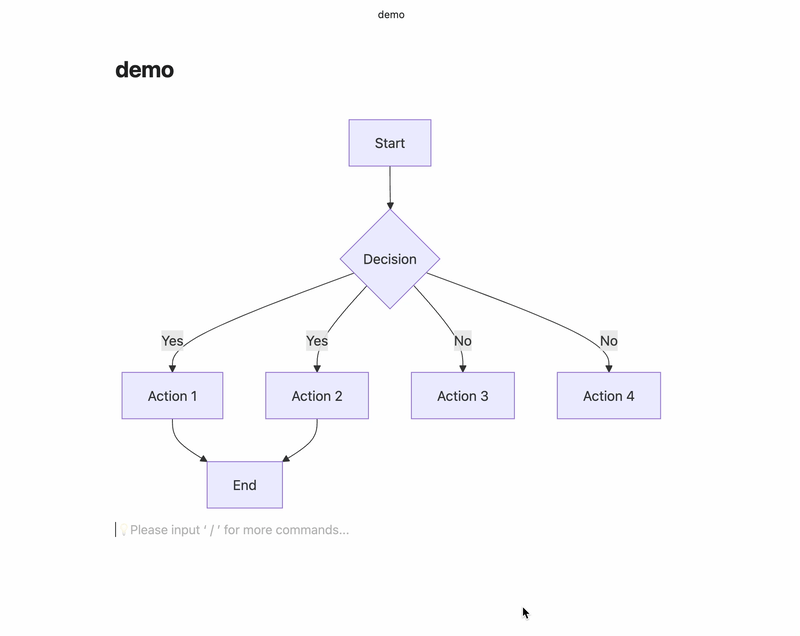
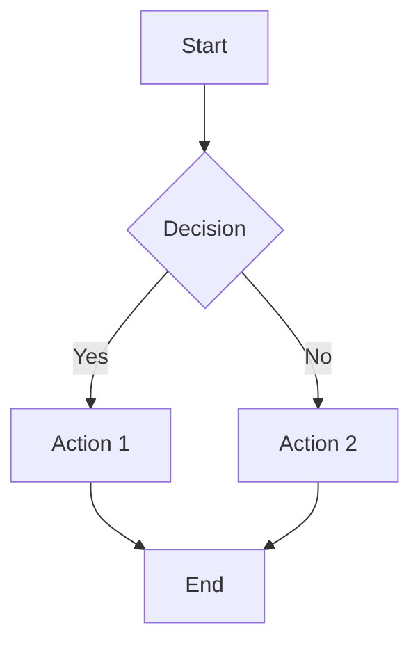

# Mermaid View Enhancer

[](https://github.com/toole2525/mermaid-view-enhancer/releases)
[](https://opensource.org/licenses/MIT)

> Transform your Mermaid diagrams into interactive, zoomable experiences within Obsidian.

## ✨ Features

**Mermaid View Enhancer** supercharges your Mermaid diagrams with smooth zoom, pan, and interactive viewing capabilities, making complex diagrams easier to explore and understand.

### 🔍 **Smart Zoom & Pan**
- **Mouse wheel zoom** centered on cursor position (100% - 300%)
- **Drag to pan** at any zoom level - no more restrictions!
- **Pinch to zoom** support for touch devices
- **Double-click to reset** back to 100% and center position

### 📐 **Flexible Display**
- **Container width adjustment** - fit wide diagrams perfectly
- **Auto/Custom/Full-width** display modes
- **Responsive design** that works on desktop and mobile

### ⚙️ **Customizable Settings**
- Adjustable maximum zoom level
- Mouse wheel sensitivity (25% - 200%)
- Animation speed control
- Simple, intuitive configuration

## 🎬 Demo



*Smooth zooming and panning make complex diagrams accessible*

## 📦 Installation

### From Obsidian Community Plugins (Recommended)

1. Open **Settings** in Obsidian
2. Go to **Community Plugins** and disable **Safe Mode**
3. Click **Browse** and search for "**Mermaid View Enhancer**"
4. Click **Install** and then **Enable**

### Manual Installation

1. Download the latest release from [GitHub Releases](https://github.com/toole2525/mermaid-view-enhancer/releases)
2. Extract the files to `{VaultFolder}/.obsidian/plugins/mermaid-view-enhancer/`
3. Reload Obsidian and enable the plugin in **Community Plugins**

## 🚀 Usage

Once installed, the plugin automatically enhances all Mermaid diagrams in your vault.

### Basic Controls

| Action | Desktop | Mobile |
|--------|---------|--------|
| **Zoom In/Out** | Mouse wheel | Pinch gesture |
| **Pan/Move** | Click & drag | Touch & drag |
| **Reset View** | Double-click | Double-tap |

### Example



*Try zooming and panning on the diagram above!*

## ⚙️ Configuration

Access settings via **Settings → Plugin Options → Mermaid View Enhancer**

### Zoom Settings
- **Maximum zoom level**: Control how far you can zoom in (2x - 5x)
- **Mouse wheel sensitivity**: Adjust zoom speed (25% - 200%)
- **Animation duration**: Set transition smoothness (0 - 0.5s)

### Display Settings
- **Container width mode**: 
  - **Auto**: Use Obsidian's default width
  - **Custom**: Set specific pixel width
  - **Full width**: Expand to full window width

## 🔧 Technical Details

- **Minimum zoom**: Fixed at 100% (original size)
- **No library dependencies**: Lightweight and fast
- **Memory efficient**: Uses WeakSet for element tracking
- **Cross-platform**: Works on Windows, macOS, Linux, iOS, and Android

## 🤝 Contributing

Contributions are welcome! Please feel free to submit issues, feature requests, or pull requests.

### Development Setup

```bash
# Clone the repository
git clone https://github.com/toole2525/mermaid-view-enhancer.git
cd mermaid-view-enhancer

# Install dependencies
npm install

# Start development mode
npm run dev

# Build for production
npm run build
```

## 📄 License

This project is licensed under the MIT License - see the [LICENSE](LICENSE) file for details.

## 🙏 Acknowledgments

- Built for the amazing [Obsidian](https://obsidian.md/) community
- Inspired by the need for better diagram interaction
- Thanks to all beta testers and contributors

## 📞 Support

- **Issues**: [GitHub Issues](https://github.com/toole2525/mermaid-view-enhancer/issues)
- **Discussions**: [GitHub Discussions](https://github.com/toole2525/mermaid-view-enhancer/discussions)
- **Documentation**: [Wiki](https://github.com/toole2525/mermaid-view-enhancer/wiki)

---

<div align="center">

**Made with ❤️ for the Obsidian community**

[⭐ Star this repo](https://github.com/toole2525/mermaid-view-enhancer) if it helped you!

</div>
